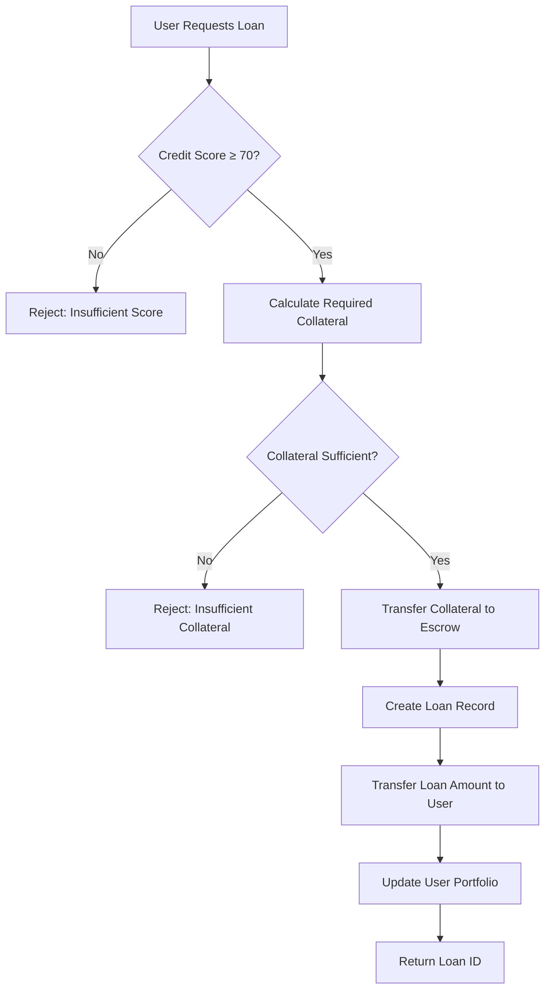
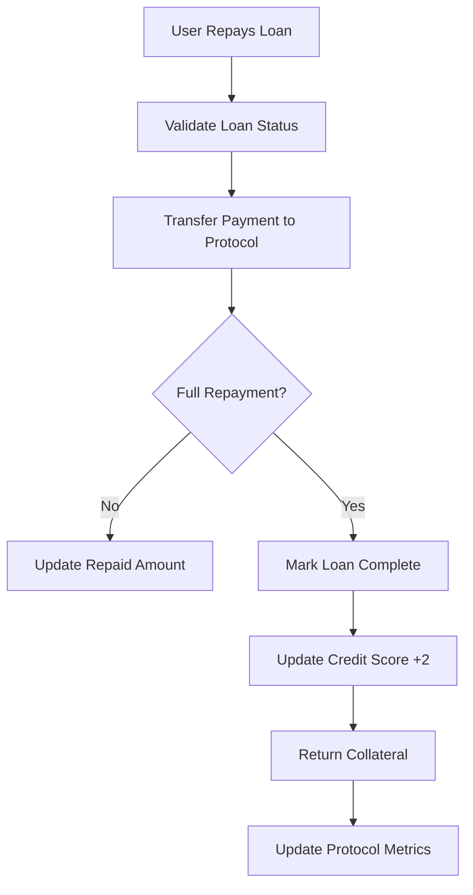
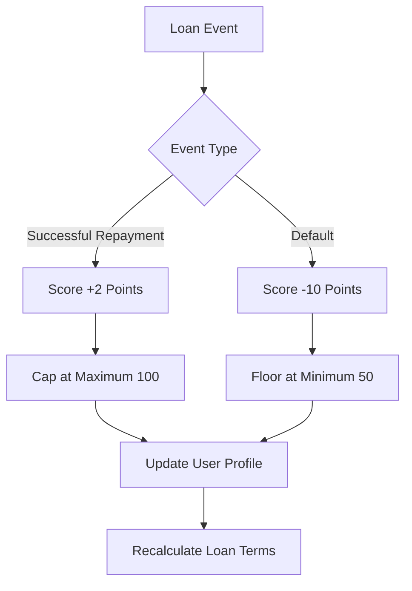

# BitTrust Protocol 🚀

## Intelligent Credit-Based Lending Platform for Bitcoin Layer 2

[](https://stacks.co/)
[](https://bitcoin.org/)
[](https://clarity-lang.org/)

## 🎯 Overview

BitTrust Protocol revolutionizes decentralized lending by introducing a **self-evolving credit infrastructure** built specifically for Bitcoin's Layer 2. Unlike traditional DeFi protocols that require 100%+ collateralization, BitTrust enables creditworthy users to borrow with **as little as 50% collateral** through our intelligent behavioral scoring system.

### Key Innovation
- **Dynamic Collateral Requirements**: Credit scores unlock reduced collateral needs
- **Adaptive Interest Rates**: Reward financial responsibility with premium rates
- **Bitcoin-Native Security**: Leverages Stacks blockchain's Bitcoin-anchored consensus
- **Progressive Trust Building**: Users evolve from standard to elite borrowing privileges

## 🏗 System Architecture

### High-Level Architecture

```
┌─────────────────────────────────────────────────────────────────┐
│                    BitTrust Protocol Layer                      │
├─────────────────────────────────────────────────────────────────┤
│  Credit Engine  │  Loan Manager  │  Risk Assessment  │  Admin   │
├─────────────────────────────────────────────────────────────────┤
│                    Stacks Blockchain Layer                      │
├─────────────────────────────────────────────────────────────────┤
│                    Bitcoin Security Layer                       │
└─────────────────────────────────────────────────────────────────┘
```

### Core Components

#### 1. **Credit Scoring Engine**
- **Dynamic Scoring**: Range from 50 (minimum) to 100 (maximum)
- **Behavioral Tracking**: Monitors loan history, repayment patterns
- **Progressive Rewards**: +2 points per successful repayment
- **Default Penalties**: -10 points for loan defaults

#### 2. **Intelligent Loan Manager**
- **Collateral Optimization**: `Required Collateral = Amount × (100 - Score×0.5)%`
- **Interest Rate Calculation**: `Rate = 10% - (Score×0.05)`
- **Duration Flexibility**: Up to 1 year (52,560 blocks)
- **Portfolio Limits**: Maximum 5 active loans per user

#### 3. **Risk Management System**
- **Automated Default Detection**: Time-based loan status monitoring
- **Collateral Escrow**: Secure STX token custody
- **Credit Score Adjustments**: Real-time behavioral scoring updates

## 🔧 Contract Architecture

### Data Structures

```clarity
UserScores Map:
├── score: uint (50-100)
├── total-borrowed: uint
├── total-repaid: uint
├── loans-taken: uint
├── loans-repaid: uint
└── last-update: uint

Loans Map:
├── borrower: principal
├── amount: uint
├── collateral: uint
├── due-height: uint
├── interest-rate: uint
├── is-active: bool
├── is-defaulted: bool
└── repaid-amount: uint

UserLoans Map:
└── active-loans: (list 20 uint)
```

### Function Categories

#### **Public Functions**
- `initialize-score()` - Create user credit profile
- `request-loan(amount, collateral, duration)` - Apply for new loan
- `repay-loan(loan-id, amount)` - Process loan repayments
- `mark-loan-defaulted(loan-id)` - Admin default management

#### **Read-Only Functions**
- `get-user-score(user)` - Retrieve credit profile
- `get-loan(loan-id)` - Access loan details
- `get-user-active-loans(user)` - View active loans

#### **Private Functions**
- `calculate-required-collateral()` - Dynamic collateral computation
- `calculate-interest-rate()` - Credit-based rate calculation
- `update-credit-score()` - Behavioral scoring updates
- `update-user-loans()` - Portfolio management

## 📊 Data Flow

### Loan Request Flow



### Repayment Flow



### Credit Scoring Flow



## 🚀 Getting Started

### Prerequisites
- Stacks blockchain environment
- Clarity CLI or compatible development tools
- STX tokens for testing

### Deployment

1. **Clone Repository**
```bash
git clone https://github.com/your-org/bittrust-protocol
cd bittrust-protocol
```

2. **Deploy Contract**
```bash
clarinet deploy --network testnet
```

3. **Initialize User Profile**
```clarity
(contract-call? .bittrust-protocol initialize-score)
```

### Example Usage

#### Request a Loan
```clarity
;; Request 1000 STX loan with 600 STX collateral for 5000 blocks
(contract-call? .bittrust-protocol request-loan u1000 u600 u5000)
```

#### Repay Loan
```clarity
;; Repay 500 STX toward loan ID 1
(contract-call? .bittrust-protocol repay-loan u1 u500)
```

#### Check Credit Score
```clarity
;; View user's credit profile
(contract-call? .bittrust-protocol get-user-score 'ST1PQHQKV0RJXZFY1DGX8MNSNYVE3VGZJSRTPGZGM)
```

## 📋 Error Codes

| Code | Constant | Description |
|------|----------|-------------|
| u1 | ERR-UNAUTHORIZED | Insufficient permissions |
| u2 | ERR-INSUFFICIENT-BALANCE | Inadequate collateral |
| u3 | ERR-INVALID-AMOUNT | Invalid loan/payment amount |
| u4 | ERR-LOAN-NOT-FOUND | Loan doesn't exist |
| u5 | ERR-LOAN-DEFAULTED | Loan in default status |
| u6 | ERR-INSUFFICIENT-SCORE | Credit score below threshold |
| u7 | ERR-ACTIVE-LOAN | Too many active loans |
| u8 | ERR-NOT-DUE | Loan not yet due |
| u9 | ERR-INVALID-DURATION | Invalid loan duration |
| u10 | ERR-INVALID-LOAN-ID | Invalid loan identifier |

## 🔒 Security Features

- **Multi-signature Admin Controls**: Contract owner permissions
- **Automated Default Management**: Time-based loan monitoring
- **Collateral Escrow Protection**: Secure STX custody
- **Credit Score Integrity**: Tamper-resistant behavioral tracking
- **Portfolio Risk Limits**: Maximum 5 concurrent loans

## 🤝 Contributing

We welcome contributions to improve BitTrust Protocol! Please:

1. Fork the repository
2. Create a feature branch
3. Submit a pull request with detailed description
4. Ensure all tests pass

## 📄 License

MIT License - see [LICENSE](LICENSE) file for details.
